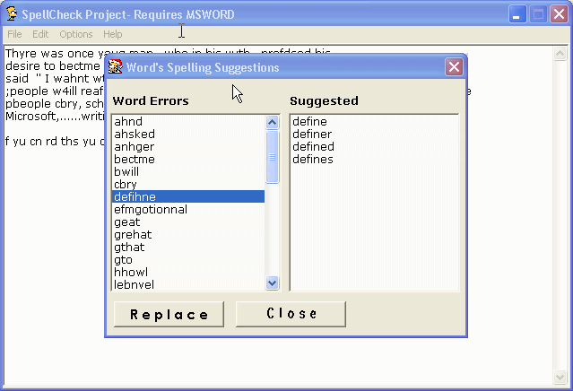



## IMPORT MS\-WORD Spell Check to your Apps \(480,000 words \+ Sugestions\)

### Description

Its ok to have your own spell check but Who wants to install a 5 MB Dictionary File with their application. The best solution is to borrow a DLL from MS WORD, is this not a simple solution. This code now imports Dictionary of the MsWord to its own application. It verifies the grammatical errors and suggests the correct word replacement. Have a look at screenshot. This is really a nice example. It also had a very good Find and Replace Example. Try it and you will know.
 
### More Info
 

             |
---                |---
**Submitted On**   |2003-11-04 16:16:16
**By**             |[Sriharish\.H](https://github.com/Planet-Source-Code/PSCIndex/blob/master/ByAuthor/sriharish-h.md)
**Level**          |Beginner
**User Rating**    |4.7 (42 globes from 9 users)
**Compatibility**  |VB 5\.0, VB 6\.0
**Category**       |[Complete Applications](https://github.com/Planet-Source-Code/PSCIndex/blob/master/ByCategory/complete-applications__1-27.md)
**World**          |[Visual Basic](https://github.com/Planet-Source-Code/PSCIndex/blob/master/ByWorld/visual-basic.md)
**Archive File**   |[IMPORT\_MS\-1667741142003\.zip](https://github.com/Planet-Source-Code/sriharish-h-import-ms-word-spell-check-to-your-apps-480-000-words-sugestions__1-49673/archive/master.zip)

